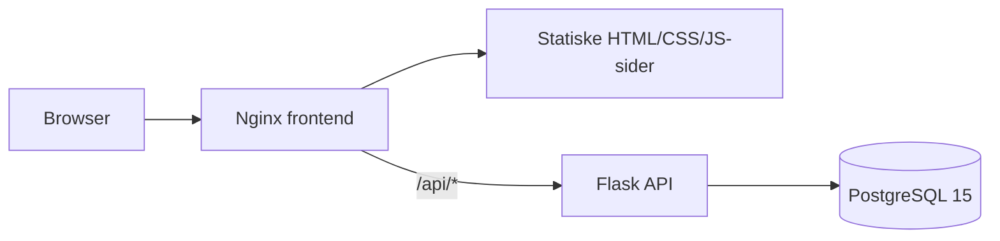

# Architecture

## Overblik

Vennekredsen er en klassisk API + statisk frontend-løsning uden SPA-framework.

## Frontend

Frontend ligger i `frontend/html/` og serveres af Nginx.

Nginx serverer de statiske sider, håndterer projektets 404-side og proxyer `/api/` til API-servicen.

## API

Backend er en Flask-applikation i `api/`.

Centrale områder er:

- autentifikation, brugere, ansøgninger og events i `api/app.py`
- lager/inventory i `api/inventory.py`
- redigerbart hjemmesideindhold og medier i `api/site_settings.py`

SQLAlchemy bruges mod PostgreSQL.

## Database

PostgreSQL 15 anvendes både lokalt og i produktions-Compose.

`api/init.sql` initialiserer en frisk database. Senere schemaændringer kan have særskilte idempotente migrationscripts, fx authentication- og site-media-migrationer.

## Containers

Lokal udvikling bruger `docker-compose.local.yml` med bind mounts til live udvikling.

Produktion bruger `docker-compose.yml` med frontend, API, PostgreSQL med persistent volume og Cloudflare Tunnel.

Se [[Deployment and Operations]] for drift og persistence.
