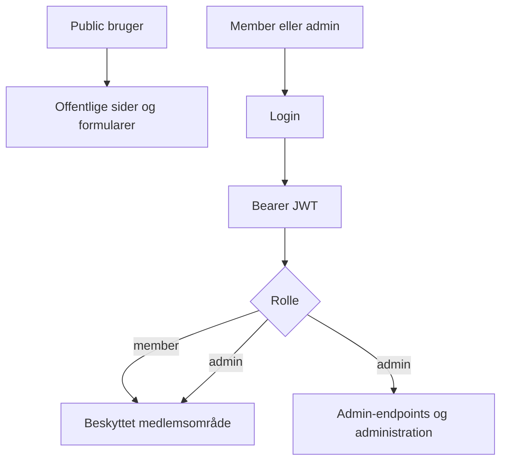

# Security and Authentication

## Roller

Applikationen har to brugerroller:

- `member`
- `admin`

Brugere kan desuden være aktive eller inaktive.



## Passwords

Nye og ændrede passwords gemmes med Argon2id.

Historiske SHA-256 hashes understøttes kun som migrationsvej. Ved succesfuldt login opgraderes et gammelt hash til Argon2id.

Detaljer om migrationen findes i:

[docs/auth-migration.md](https://github.com/jfriisj/vennekredsen/blob/main/docs/auth-migration.md)

## Tokens

Beskyttede API-endpoints bruger Bearer JWT.

Admin-endpoints kontrollerer rollen server-side og returnerer 403 for autentificerede brugere uden admin-rettigheder.

## Fresh install

`api/init.sql` opretter ikke en default administrator eller et default password.

Første administrator oprettes interaktivt:

```bash
./dev.sh create-admin
```

## Secrets

Produktionsværdier skal leveres gennem installationsspecifik miljøkonfiguration.

Commit ikke reelle passwords, JWT secrets, tunnel tokens eller lokale produktions-`.env`-filer.
